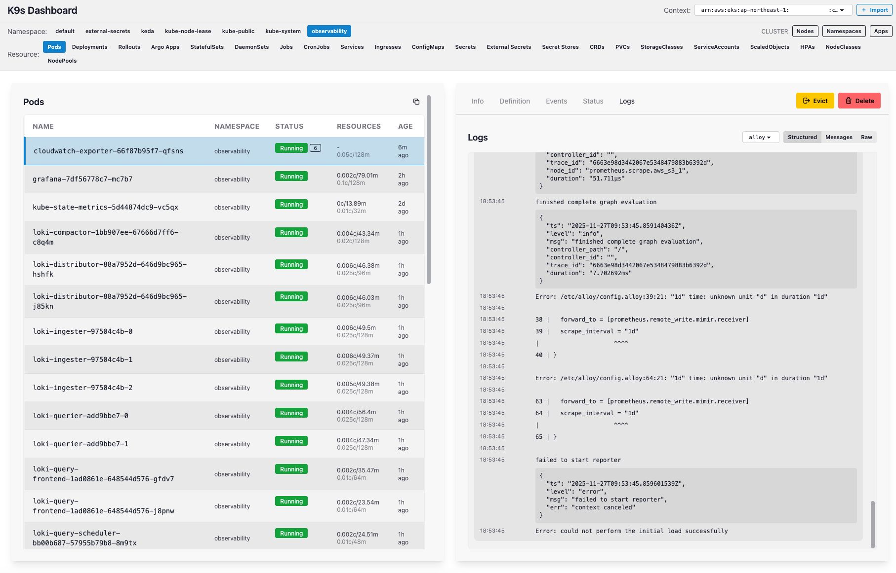

# k9s Dashboard

A web-based Kubernetes dashboard built with SolidJS and Fastify. Provides a modern UI for viewing and managing Kubernetes resources with real-time updates.



## Features

### Core Kubernetes Resources

- **Pods** - List, view details, events, status, YAML manifests, and live log streaming per container. Delete and evict pods.
- **Deployments** - List, view details, scale replicas, restart, rollback to previous revisions, view revision history.
- **StatefulSets** - List, view details, scale replicas, restart.
- **DaemonSets** - List, view details, restart.
- **Jobs** - List, view details, delete.
- **CronJobs** - List, view details, suspend/resume scheduling, delete.
- **Services** - List, view details, associated pods, and endpoints.
- **ConfigMaps** - List, view details and data.
- **Secrets** - List, view details and decoded values.
- **HPAs** - List, view details and scaling metrics.
- **Ingresses** - List, view details and routing rules.
- **PersistentVolumeClaims** - List, view details and bound volumes.
- **ServiceAccounts** - List, view details.
- **Namespaces** - List with resource summaries.
- **Nodes** - List with capacity, allocatable resources, and pool membership.
- **StorageClasses** - List, view details.
- **CustomResourceDefinitions** - List, view details.

### Custom Resource Support

Automatic detection and support for popular Kubernetes extensions:

- **Argo Rollouts** - Progressive delivery with canary and blue-green deployments.
- **Argo CD Applications** - GitOps application state and sync status.
- **External Secrets** - External Secrets Operator integration for secret sync status.
- **Secret Stores** - External Secrets Operator secret store configurations.
- **KEDA ScaledObjects** - Event-driven autoscaling configurations.
- **Karpenter NodeClasses** - Node provisioning templates for AWS.
- **Karpenter NodePools** - Node pool configurations and limits.

### Real-Time Updates

- **Server-Sent Events (SSE)** - Live pod status updates without polling.
- **Log Streaming** - Real-time container log tailing with JSON formatting support.

### Multi-Cluster Support

- **Context Switching** - Switch between kubectl contexts from the UI.
- **AWS EKS Import** - Import EKS clusters directly using AWS profiles and regions.

## Tech Stack

- **Frontend**: SolidJS, Tailwind CSS v4, DaisyUI, Vite, TypeScript
- **Backend**: Fastify, @kubernetes/client-node, TypeScript
- **Monorepo**: pnpm workspaces

## Prerequisites

- Node.js 20+
- pnpm 9+
- kubectl configured with at least one context
- (Optional) AWS CLI configured for EKS cluster import

## Getting Started

```bash
# Install dependencies
pnpm install

# Start development servers (frontend + backend)
pnpm dev
```

The frontend runs on http://localhost:3131 and proxies API requests to the backend on port 3130.

## Development Commands

```bash
# Start both frontend and backend
pnpm dev

# Start only frontend
pnpm dev:frontend

# Start only backend
pnpm dev:backend

# Type check
pnpm --filter k9s-dashboard-frontend typecheck
pnpm --filter k9s-dashboard-backend typecheck

# Build
pnpm --filter k9s-dashboard-frontend build
pnpm --filter k9s-dashboard-backend build
```

## Project Structure

```
apps/
├── frontend/          # SolidJS frontend app (port 3131)
│   ├── src/
│   │   ├── components/    # UI components
│   │   ├── routes/        # Page components
│   │   ├── lib/           # API client utilities
│   │   ├── stores/        # SolidJS reactive stores
│   │   └── utils/         # Helper functions
│   └── vite.config.ts
└── backend/           # Fastify backend API (port 3130)
    ├── src/
    │   ├── routes/        # API route handlers
    │   └── services/      # Kubernetes client services
    └── index.ts
```

## Security

- Kubernetes credentials stay server-side and are never exposed to the browser.
- Uses local kubeconfig for authentication (supports AWS IAM exec plugins for EKS).
- No authentication required for local development - the dashboard inherits your kubectl permissions.

## License

MIT
